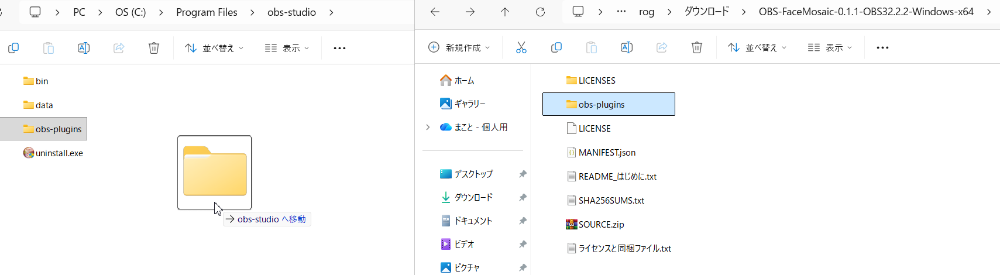
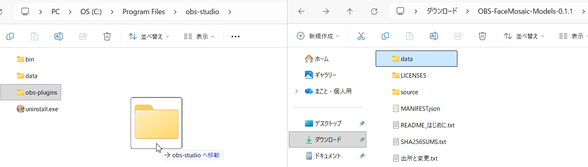
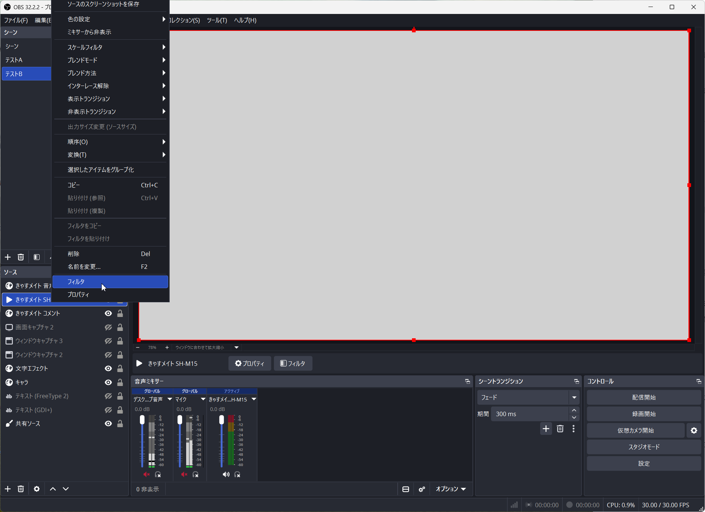
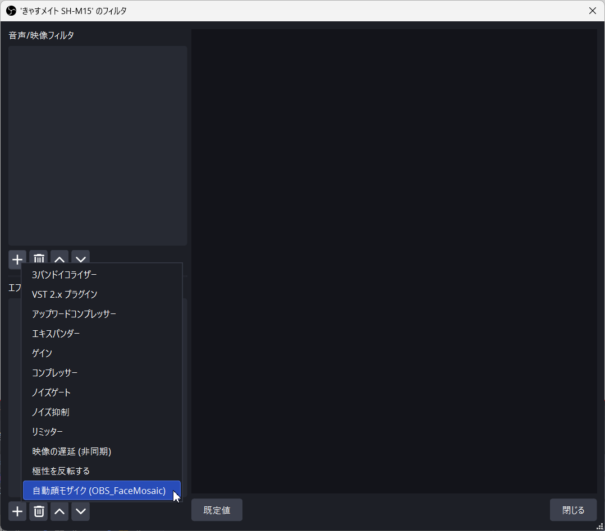
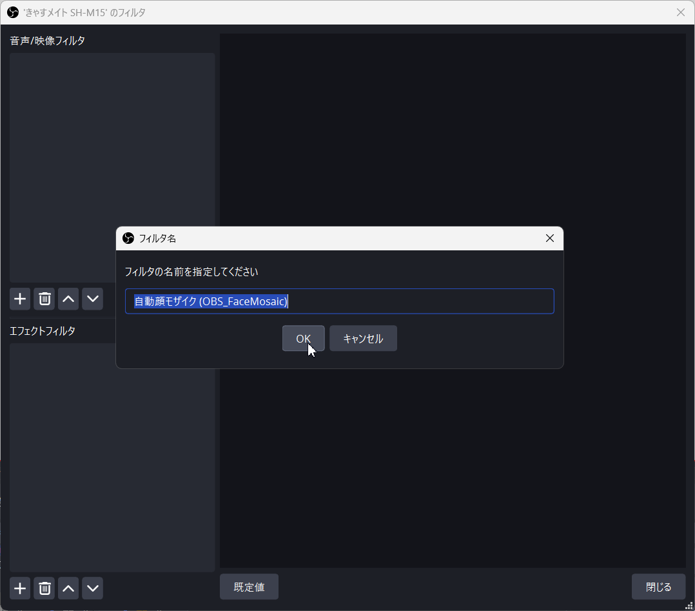
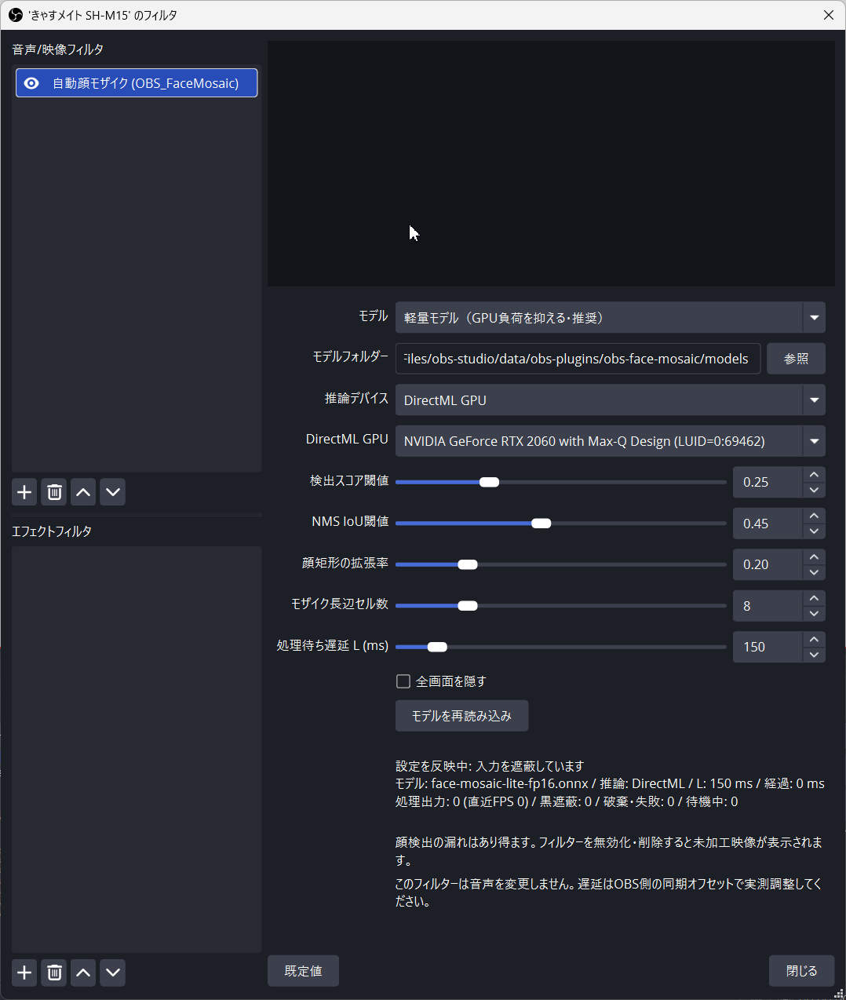
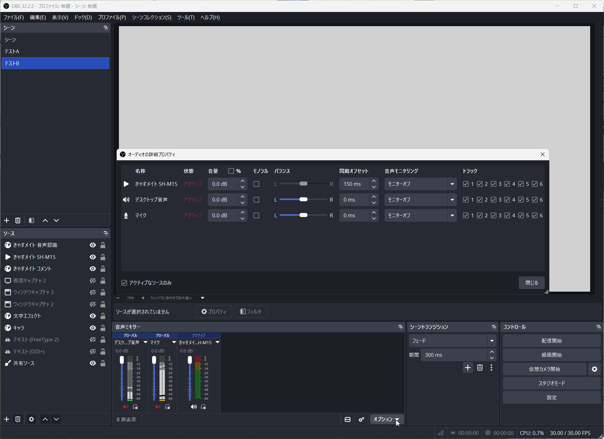

# OBS_FaceMosaic 画像付き導入ガイド

OBSのメディアソースに「自動顔モザイク (OBS_FaceMosaic)」を追加する手順です。プラグインとモデルを配置し、テスト映像の録画でモザイクと音声同期を確認します。

対象は **プラグイン0.1.1・共通モデルパック0.1.1・Windows x64・OBS 32.2.2／30.2.3** です。スクリーンショットはOBS 32.2.2の例です。ソース名、GPU名、インストール先は環境によって異なります。

> **使用前に確認してください**
>
> 顔の検出漏れや隠す範囲の不足があり、すべての顔を隠せる保証はありません。本番利用の合格判定はしていません。まず専用のテスト用プロファイル・シーンコレクションで確認してください。フィルターを無効化・削除すると、未加工映像が表示されます。

## 手順の一覧

1. [必要なファイルをダウンロード](#download)
2. [プラグインをコピー](#install-plugin)
3. [モデルをコピー](#install-models)
4. [映像ソースのフィルターを開く](#open-filter)
5. [自動顔モザイクを追加](#add-filter)
6. [モデルとGPUを確認](#settings)
7. [録画で動作を確認](#check-output)
8. [音声と映像のずれを調整](#audio-sync)

画像をクリックすると元の大きさで確認できます。

<a id="download"></a>
## 1 必要なファイルをダウンロード

OBSのタイトルバー、または「ヘルプ」→「OBS Studioについて」で、使っているOBSの版を確認します。

**プラグインZIPと共通モデルZIPの両方が必要です。** 次のリンク先で「Assets」を開き、該当するファイルを取得してください。

| 使用するOBS | [プラグイン0.1.1の配布ページ](https://github.com/kyokutyou/OBS_FaceMosaic/releases/tag/v0.1.1)で取得するファイル |
| --- | --- |
| OBS 32.2.2 | `OBS-FaceMosaic-0.1.1-OBS32.2.2-Windows-x64.zip` |
| OBS 30.2.3 | `OBS-FaceMosaic-0.1.1-OBS30.2.3-Windows-x64.zip` |

続いて、[共通モデルパック0.1.1の配布ページ](https://github.com/kyokutyou/OBS_FaceMosaic/releases/tag/models-v0.1.1)から `OBS-FaceMosaic-Models-0.1.1.zip` を取得します。モデルZIPは両方のOBS版で共通です。

`SOURCE.zip` とGitHubの「Source code」はソースコードです。配布済みプラグインを使う場合、自分でビルドする必要はありません。

2つのZIPをそれぞれ右クリックし、「すべて展開」で展開します。ZIPの中を表示しただけの状態ではなく、展開先のフォルダーを開いてからコピーしてください。

プラグインの動作には **Microsoft Visual C++ v14ランタイムのx64版** も必要です。未導入・古い場合は、[Microsoft公式のダウンロード案内](https://learn.microsoft.com/ja-jp/cpp/windows/latest-supported-vc-redist)から対応するx64版を導入します。

**確認するポイント：** OBSの版とプラグインZIPの版が一致し、モデルZIPも取得できていること。他のOBS版、Windowsの32ビット版・ARM64、macOS、Linuxは確認対象外です。

<a id="install-plugin"></a>
## 2 プラグインをコピー

1. **OBSを終了**します。
2. OBSのインストール先を開きます。通常は `C:\Program Files\obs-studio` です。別ドライブやportable版の場合は、使うOBSのフォルダーを開きます。
3. 更新の場合は、OBS側の `obs-plugins\64bit` にある同名の3 DLLを別の場所へバックアップします。
4. 展開したプラグインの **`obs-plugins` フォルダーを選んで Ctrl+C** を押します。
5. OBSのインストール先で **Ctrl+V** を押してコピーします。Windowsの管理者確認が出たら内容を確認して許可します。

[](images/usage/01-plugin-copy.png)

**画像の右側がコピー元、左側がコピー先です。** 画像にはドラッグ中の「移動」と表示されていますが、この手順ではCtrl+CとCtrl+Vでコピーします。既存の `obs-plugins` フォルダーを削除せず、中へ配布ファイルを追加します。同名ファイルを更新する場合は、先にバックアップを済ませてください。

**確認するポイント：** OBS側の `obs-plugins\64bit` に、次の3ファイルがあること。

```text
obs-face-mosaic.dll
onnxruntime.dll
DirectML.dll
```

<a id="install-models"></a>
## 3 モデルをコピー

1. OBSを終了したまま、展開した共通モデルパックを開きます。
2. **`data` フォルダーを選んで Ctrl+C** を押します。
3. 手順2と同じOBSのインストール先で **Ctrl+V** を押します。`data` の中へもう一つ `data` を入れないよう、コピー先を確認します。

[](images/usage/02-model-copy.png)

この画像も右側がコピー元、左側がコピー先です。ドラッグによる移動ではなく、コピーします。既存の `data` フォルダーは削除しません。

**確認するポイント：** コピー後の配置が次の形になっていること。通常のインストール先を例にしています。

```text
C:\Program Files\obs-studio\
├─ obs-plugins\
│  └─ 64bit\
│     ├─ obs-face-mosaic.dll
│     ├─ onnxruntime.dll
│     └─ DirectML.dll
└─ data\
   └─ obs-plugins\
      └─ obs-face-mosaic\
         └─ models\
            ├─ face-mosaic-lite-fp16.onnx
            ├─ face-mosaic-detail-fp16.onnx
            ├─ face-mosaic-lite-fp32.onnx
            └─ face-mosaic-detail-fp32.onnx
```

<a id="open-filter"></a>
## 4 映像ソースのフィルターを開く

1. OBSを起動し、テスト用のプロファイル・シーンコレクションを選びます。
2. **映像を受け取っている標準メディアソース**を選びます。画像の「きゃすメイト SH-M15」はソース名の例です。自分の映像ソースを選んでください。
3. ソースを右クリックして **「フィルタ」** を開きます。

[](images/usage/03-open-filters.png)

**確認するポイント：** コメント表示や音声認識などのソースではなく、顔を隠したい映像のメディアソースを選んでいること。

SRTの受信設定はOBSが担当します。このプラグインにSRT URLを入力する必要はありません。受信設定がまだの場合は、[OBS公式のSRT受信手順](https://obsproject.com/kb/srt-protocol-streaming-guide)を確認し、テスト用メディアソースで受信を準備してください。

<a id="add-filter"></a>
## 5 自動顔モザイクを追加

フィルター画面の左上にある **「音声/映像フィルタ」の＋** を押し、**「自動顔モザイク (OBS_FaceMosaic)」** を選びます。下側の「エフェクトフィルタ」の＋とは位置が異なります。

[](images/usage/04-add-filter.png)

名前を指定する画面が出たら、通常はそのまま **「OK」** を押します。

[](images/usage/05-filter-name.png)

**確認するポイント：** 左上の一覧に自動顔モザイクが追加され、有効になっていること。一覧に表示されない場合は、[フィルターが見つからない場合](#missing-filter)を確認してください。

<a id="settings"></a>
## 6 モデルとGPUを確認

最初は次の設定で確認します。画像のGPU名やフォルダーのパスを、そのまま入力する必要はありません。

| 設定欄 | 最初に確認する内容 |
| --- | --- |
| モデル | 「軽量モデル（GPU負荷を抑える・推奨）」を選ぶ |
| モデルフォルダー | 手順3で配置した `data\obs-plugins\obs-face-mosaic\models` が表示されているか確認する |
| 推論デバイス | 「DirectML GPU」を選ぶ |
| DirectML GPU | 自分のPCで利用するGPUを選ぶ |
| その他の数値 | まず初期値で動作を確認する |
| 全画面を隠す | モザイク映像を確認する時はオフにする |

[](images/usage/06-settings.png)

> **この画像は設定反映中の例です。**
>
> 下部に「設定を反映中: 入力を遮蔽しています」と表示され、処理出力は0です。モザイク処理が動作したことを示す画面ではありません。次の手順で実際の録画を確認してください。

プラグイン0.1.1では、推奨配置のモデルフォルダーを自動で使用します。以前に別のフォルダーを指定していた場合は、その指定が残ります。自動配置へ戻すには「モデルフォルダー」を空欄にします。モデルを別の場所に置く場合は、「参照」から **4モデルが入った `models` フォルダー** を指定します。

設定変更やモデル読み込み中には、一時的に黒画面になります。モデル欠損・破損やGPUの初期化失敗でも黒画面になります。[黒画面のままの場合](#black-screen)の確認をしてください。

**確認するポイント：** 設定画面の下部に、自分が選んだモデル・推論デバイスが表示されていること。GPUを変更した場合は動作を再確認します。「CPU (診断用)」は診断のための選択肢です。

<a id="check-output"></a>
## 7 録画で動作を確認

利用許可のある顔入りのテスト映像を使い、OBSで短い録画を行います。プレビューを見るだけで終わらせず、録画ファイルを再生して確認してください。

- 顔にモザイクがかかり、顔やカメラが動いた場面でも隠す範囲を確認できるか。
- 小さい顔、横顔、画面端の顔などに検出漏れがないか。
- 映像入力を停止すると、加工済み映像が残り続けず黒画面へ移るか。再開後に処理が戻るか。
- モデル・GPU・設定の変更後に、処理が再開するか。
- 別の未加工映像ソースを、同じシーンに重ねていないか。

処理状態は設定画面下部でも確認できます。入力が流れている時に「処理出力」が増えているか、モデル読込・GPU・照合のエラーが出ていないかを確認します。必要に応じて設定画面を開き直して表示を確認してください。

**処理出力が増えたことと、すべての顔が隠れたことは別です。** 録画で顔の隠し漏れを確認します。黒画面や映像の停止が続く場合は、原因を解消してから再確認してください。

<a id="audio-sync"></a>
## 8 音声と映像のずれを調整

このプラグインは音声を変更しません。映像処理による音声とのずれは、OBSの同期オフセットで調整します。

1. 手拍子など、映像と音声が同時に発生する動作をテスト録画に入れます。
2. 録画を再生し、手が合わさる瞬間と音のタイミングを比べます。すでに同期オフセットを設定している場合は、その値も確認します。
3. 「音声ミキサー」のメニューから **「オーディオの詳細プロパティ」** を開きます。画像では下部の「オプション」から開く画面です。
4. **対象映像に対応する音声の行**で「同期オフセット」を調整します。音声が映像より先に聞こえる場合は、測定したずれに応じて音声を遅らせます。数値を増やすと音声が遅くなります。
5. 再度録画してタイミングを確認します。モデル・処理待ち遅延Lを変更した時や、SRT再接続後も確認してください。

[](images/usage/07-audio-sync.png)

**画像の150msは設定例です。** 「処理待ち遅延L」が150msでも、同期オフセットを必ず150msにするわけではありません。OBS側のタイミング調整や既存の同期オフセットも含め、録画で確認したずれを基準にします。無関係なデスクトップ音声やマイクの行は変更しません。

<a id="adjustments"></a>
## 必要に応じて設定を調整

初期値は動作確認の出発点です。顔の秘匿や一定の処理速度を保証する値ではありません。1項目ずつ変更し、同じテスト映像の録画で比べます。

| 設定 | 初期値 | 調整した時の意味 |
| --- | --- | --- |
| モデル | 軽量モデル | GPUに余裕がある場合は検出重視モデルも比較する。すべての条件で検出が改善する保証はない |
| 検出スコア閾値 | 0.25 | 下げると低いスコアの候補も対象になり、誤検出も増える場合がある |
| NMS IoU閾値 | 0.45 | 重なる検出候補をまとめる条件。まず初期値のまま確認する |
| 顔矩形の拡張率 | 0.20 | 検出範囲の各辺を外側へ広げる。0.20は左右に顔幅の20%ずつ、上下に顔高さの20%ずつ追加する設定 |
| モザイク長辺セル数 | 8 | 数が小さいほどモザイクが粗くなる |
| 処理待ち遅延L | 150ms | 映像を処理して出力するまでの待ち時間の設定。変更後は録画と音声同期を再確認する |

通常モデルで読み込み・推論の問題がある場合には、対応する「互換版」も比較できます。モデルを切り替えたら録画で動作を再確認してください。

<a id="manual-mask"></a>
## 一時的に映像全体を隠す

設定内の **「全画面を隠す」** をオンにすると、このフィルターの対象映像を不透明な黒にします。戻す時は同じチェックをオフにします。黒画面中も音声は継続します。

フィルター一覧の目のアイコンで無効化したり、フィルターを削除したりすると未加工映像が表示されます。映像を隠す操作には、設定内の「全画面を隠す」を使ってください。シーン内の別ソースはこの設定では隠れません。

<a id="troubleshooting"></a>
## 困った時の確認

<a id="missing-filter"></a>
### フィルターが見つからない

- OBSをコピー後に起動し直したか。
- OBSの版とプラグインZIPの版が一致しているか。
- 起動したOBSの `obs-plugins\64bit` に3 DLLがあるか。フォルダーが二重になっていないか。
- Visual C++ v14ランタイムのx64版が導入されているか。
- 標準メディアソースの **「音声/映像フィルタ」** の追加メニューを開いているか。

それでも表示されない場合は、「ヘルプ」→「ログファイル」でプラグインの読み込みエラーを確認します。ログを他の人へ渡す前に、個人情報・接続先・認証情報が含まれていないか確認してください。

<a id="black-screen"></a>
### 黒画面のままになる

設定画面下部の状態・エラー表示から、次を確認します。

| 状態や確認箇所 | 対処 |
| --- | --- |
| 「全画面を隠す」がオン | 動作確認時はオフにする |
| 入力待ち・入力停止 | テスト用メディアソースの再生やSRT受信を確認する |
| 設定反映中・復帰確認中 | 正常な入力が続いた後に処理が再開するか確認する |
| モデルが見つからない | 指定フォルダーと、手順3の配置・ファイル名を確認する |
| SHA-256照合の失敗 | 配布モデルの欠損・破損・取り違えを確認する。別モデルを同じ名前に変更して使わない |
| GPUが見つからない・初期化失敗 | 利用できるGPUを選び直す。原因を解消して「モデルを再読み込み」を押す |
| 黒画面や破棄が頻繁に続く | 軽量モデルを選び、GPU負荷と設定を確認する。変更後の録画で比較する |

モデル読み込みに失敗した場合は、原因を解消してから **「モデルを再読み込み」** を押します。フィルターを無効化して黒画面を回避すると、未加工映像が表示されます。

<a id="audio-trouble"></a>
### 音声がずれる

対象音声の行と既存の同期オフセットを確認し、[手順8](#audio-sync)のテスト録画で調整します。処理待ち遅延Lの値を、そのまま既存のオフセットへ足さないでください。

## 使用上の制限

- 本ガイドは導入とテストの手順です。実スマホ・実ネットワークSRT、音声同期、長時間運転、広い条件での顔検出品質は未評価で、本番利用の合格を示しません。
- 検出漏れ・遮蔽不足があり得ます。フィルターが動作していても、すべての顔の秘匿を保証しません。
- モデル未準備・処理障害時は黒画面やフレーム破棄になります。過負荷時には直近の加工済み映像を一時的に再表示する場合もあります。
- フィルター無効化・削除、プラグイン未読み込み、OBSのクラッシュ、未加工ソースへの切替は、このフィルターでは防げません。
- 音声の個人情報を隠す機能はありません。

[トップのREADMEへ戻る](../README.md)
